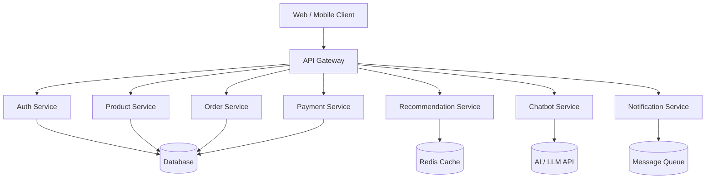

# 🛒 AI-Enhanced E-Commerce Platform


A **modern AI-powered e-commerce platform** built with **ASP.NET Core**, designed using **Clean Architecture** and prepared for **microservice scalability**.

The system simulates a **production-level online shopping platform**, integrating:

* 🛍 Product management
* 💳 Online payment gateway
* 📦 Order lifecycle
* 🤖 AI product recommendation
* 💬 AI chatbot customer support
* 📢 Notification & email system

---

# 📌 Overview

| Item         | Description                               |
| ------------ | ----------------------------------------- |
| Project      | **AI-Enhanced E-Commerce Platform**       |
| Backend      | **ASP.NET Core 8.0**                          |
| Architecture | **Service-Oriented / Microservice-ready** |
| Database     | **SQL Server / PostgreSQL**               |
| Cache        | **Redis**                                 |
| Payments     | **Stripe / PayOS**                        |
| AI           | **LLM Chatbot + Recommendation Engine**   |

This platform demonstrates **real-world backend architecture** and **AI service integration** in a modern commerce system.

---

# 🏗 System Architecture



### Key Principles

* Clean Architecture
* Service-Oriented Design
* Loose Coupling
* Scalability
* Cloud-ready infrastructure

---

# 🧩 Core Services

## 🔐 Auth Service

Handles **authentication and authorization**.

Features:

* User registration
* Login / logout
* JWT authentication
* Refresh tokens
* Role-based access control

Roles:

* **Admin**
* **Seller**
* **Customer**

Technology:

* ASP.NET Identity
* JWT Security

---

# 🛍 Product Service

Manages the **product catalog**.

Features:

* Product CRUD
* Category management
* Product variants (size, color)
* Image management
* Inventory tracking
* Product search and filtering

---

# 📦 Order Service

Handles the **shopping cart and order lifecycle**.

Features:

* Shopping cart
* Checkout process
* Shipping address
* Discount codes
* Order tracking

Order Status:

```
Pending → Paid → Shipping → Completed
                       ↘ Cancelled
```

---

# 💳 Payment Service

Supports **real-world payment integration**.

Supported Gateways:

* **Stripe**
* **PayOS**

### Payment Flow

```
Checkout
   ↓
Create Order (Pending)
   ↓
Create Payment Session
   ↓
User Pays
   ↓
Webhook from Gateway
   ↓
Verify Signature
   ↓
Update Order → Paid
```

Features:

* Webhook verification
* Idempotency protection
* Refund support
* Transaction lifecycle management

---

# 🚚 Shipping Service

Manages product delivery.

Features:

* Shipping provider integration
* Tracking codes
* Region-based shipping fees

---

# ⭐ Review & Rating

Customers can evaluate purchased products.

Features:

* Star rating
* Product reviews
* Purchase verification

---

# ❤️ Wishlist

Users can save favorite products.

Features:

* Add to wishlist
* Remove from wishlist
* Quick access to favorite products

---

# 📊 Admin Dashboard

Administration tools for platform management.

Features:

* User management
* Product management
* Order monitoring
* Revenue analytics
* Business statistics

---

# 🤖 Recommendation Service

Provides **intelligent product suggestions**.

### Data Sources

User behavior tracking:

* Product views
* Searches
* Purchase history

### Recommendation Methods

| Type           | Method                           |
| -------------- | -------------------------------- |
| Rule-based     | Same category / popular products |
| Behavior-based | Similar user preferences         |
| ML-based       | External Python ML service       |

### API

```
GET /recommendation/home
GET /recommendation/product/{id}
GET /recommendation/user/{id}
```

---

# 💬 AI Chatbot Service

An **AI-powered customer support assistant**.

Capabilities:

* Answer FAQs
* Recommend products
* Check order status
* Guide users through purchasing

### Architecture

```
Chat UI
   ↓
Chatbot Service
   ↓
LLM API
   ↘ Knowledge Base
     (FAQ + Product + Order)
```

Stored data:

* ChatMessages
* ConversationContext

---

# 📢 Notification Service

Handles system notifications.

Examples:

* Order confirmation email
* Payment success notification
* Password reset email

Implementation:

* Background jobs
* Email service integration

---

# 🧠 Tech Stack

| Layer        | Technology                |
| ------------ | ------------------------- |
| Backend      | ASP.NET Core              |
| Architecture | Clean Architecture        |
| Auth         | ASP.NET Identity + JWT    |
| Database     | SQL Server / PostgreSQL   |
| Cache        | Redis                     |
| Payments     | Stripe / PayOS            |
| AI           | LLM API                   |
| Queue        | RabbitMQ / Kafka          |
| Jobs         | Hangfire / Worker Service |
| Container    | Docker                    |

---

# 📂 Project Structure

Example structure:

```
src/
 ├── ApiGateway
 ├── Services
 │    ├── AuthService
 │    ├── ProductService
 │    ├── OrderService
 │    ├── PaymentService
 │    ├── RecommendationService
 │    ├── ChatbotService
 │    └── NotificationService
 │
 ├── Shared
 │    ├── Contracts
 │    ├── Common
 │    └── Infrastructure
```

---

# 🚀 Getting Started

## 1️⃣ Clone Repository

```bash
git clone https://github.com/your-username/ecommerce-platform.git
cd ecommerce-platform
```

---

## 2️⃣ Run with Docker

```bash
docker compose up -d
```

This `docker compose` setup starts **infrastructure only** (Keycloak + Postgres). The ASP.NET Core backend is intended to run **locally**.

---

## 3️⃣ Run Backend

```bash
cd shopbend
dotnet restore
dotnet build
dotnet run --project Shopbe.Web
```

---

# 📡 Example API

### Create Product

```
POST /api/products
```

Request

```json
{
  "name": "Running Shoes",
  "price": 99,
  "category": "Shoes",
  "stock": 50
}
```

---

### Get Recommendations

```
GET /recommendation/home
```

---

# 🧪 Future Improvements

* AI recommendation model training
* Real-time recommendation streaming
* Full microservice deployment
* Kubernetes orchestration
* Event-driven architecture
* Advanced analytics dashboard

---

# 🎯 Learning Outcomes

This project demonstrates:

* Scalable backend architecture
* Real-world payment integration
* AI system integration
* RESTful API design
* Microservice-ready system design

---

# 📜 License

This project is licensed under the **MIT License**.

